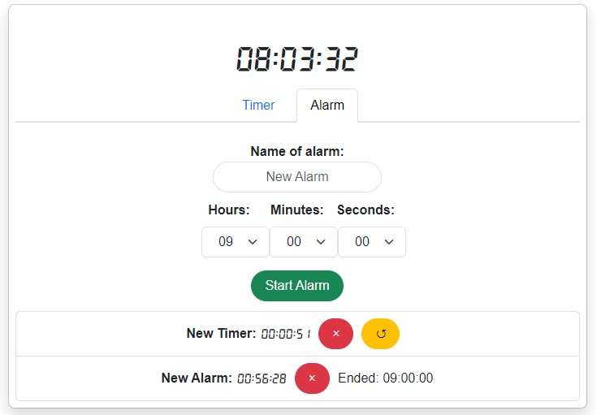
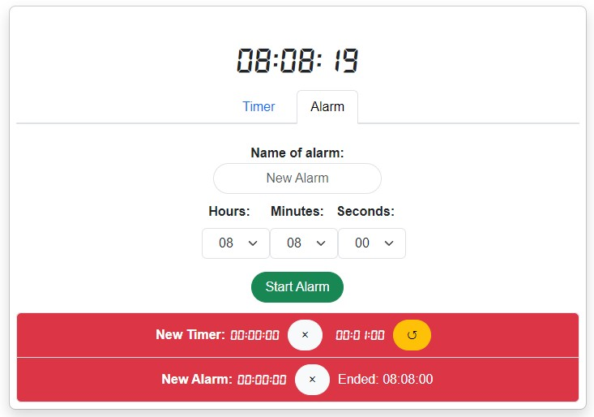

# Timer App


A simple timer application built with React and Bootstrap that allows users to set a countdown timer and monitor the remaining time.

## Table of Contents

- [About](#about)
- [Getting Started](#getting-started)
  - [Prerequisites](#prerequisites)
  - [Installation](#installation)
- [Usage](#usage)
- [Features](#features)
- [Screenshots](#screenshots)
- [Contributing](#contributing)
- [License](#license)
- [Acknowledgements](#acknowledgements)

## About

The Timer App is a web-based React application that allows users to set a timer for a specific duration, start the timer, and monitor the remaining time in hours, minutes, and seconds. 

It's a simple and intuitive tool for tasks that require time management and tracking.

## Getting Started

### Prerequisites

Before you can use the Timer App, make sure you have the following software/tools installed:

- Node.js 
- npm (Node Package Manager)

### Installation

1. Clone the Timer App repository to your local machine:

   ```shell
   git clone https://github.com/YourUsername/TimerApp.git
   ```

2. Navigate to the project directory:

   ```shell
   cd TimerApp
   ```

3. Install the required dependencies:

   ```shell
   npm install
   ```

## Usage

1. Start the Timer App by running the following command:

   ```shell
   npm start
   ```

2. Open your web browser and visit `http://localhost:3000`.

3. Set the timer duration by entering the number of hours, minutes, and seconds in their respective input fields.

4. Click the "Start" button to begin the countdown.

5. The remaining time will be displayed in the "Time Left" section.

6. To reset the timer, click the "Reset" button.

## Features

- Set a timer for a specific duration (hours, minutes, seconds).
- Start, pause, and reset the timer.
- Monitor the remaining time in a user-friendly format (HH:MM:SS).
- Intuitive user interface for easy navigation.

## Screenshots

### New timer added


### Timer expired


## Contributing

We welcome contributions from the community to improve the Timer App. If you find any bugs, have suggestions for new features, or want to contribute in any way, please follow our [contributing guidelines](CONTRIBUTING.md).


## Acknowledgements

- The Timer App was inspired by the need for a simple yet effective timer tool for everyday tasks.
- I would like to thank the React community for providing a powerful framework for building web applications.

